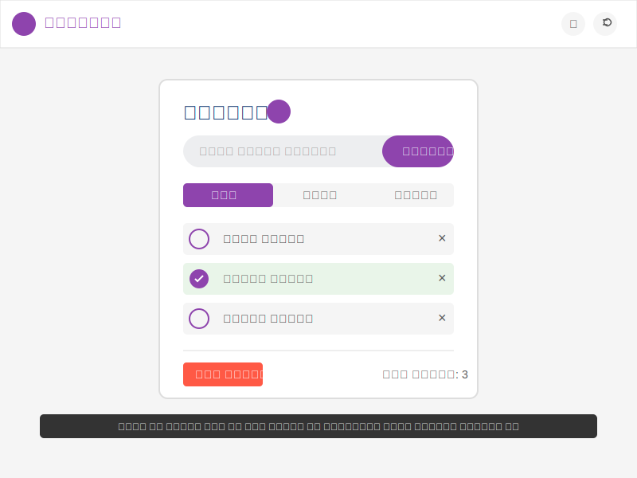

# TASKBELL - To-Do List Application with Notifications
# टास्कबेल - नोटिफिकेशन के साथ टू-डू लिस्ट एप्लिकेशन

A powerful to-do list web application that helps you manage your tasks with deadlines and notifications.
एक शक्तिशाली टू-डू लिस्ट वेब एप्लिकेशन जो आपको समय सीमा और नोटिफिकेशन के साथ अपने कार्यों को प्रबंधित करने में मदद करता है।

## Features | विशेषताएँ

- Add, remove, and complete tasks | कार्य जोड़ें, हटाएं और पूरा करें
- Set deadlines and estimated time for tasks | कार्यों के लिए समय सीमा और अनुमानित समय निर्धारित करें
- Receive notifications for task deadlines | कार्य समय सीमा के लिए नोटिफिकेशन प्राप्त करें
  - 50% time remaining reminder | 50% समय शेष रिमाइंडर
  - 10% time remaining alert | 10% समय शेष अलर्ट
  - Deadline expiration notification | समय सीमा समाप्ति नोटिफिकेशन
  - Congratulations on early/on-time completion | समय से पहले/समय पर पूरा करने पर बधाई
- Visual progress indicators for remaining time | शेष समय के लिए दृश्य प्रगति संकेतक
- Filter tasks (All, Pending, Completed) | कार्यों को फ़िल्टर करें (सभी, बाकी, पूर्ण)
- Clear all tasks with one click | एक क्लिक में सभी कार्य हटाएं
- Save tasks in local storage | लोकल स्टोरेज में कार्य सेव करें
- Hindi and English language support | हिंदी और अंग्रेजी भाषा समर्थन
- Light and Dark theme | लाइट और डार्क थीम
- Responsive design - works well on mobile and desktop | रिस्पॉन्सिव डिज़ाइन - मोबाइल और डेस्कटॉप पर अच्छी तरह से काम करता है
- Animated bell logo | एनिमेटेड घंटी लोगो

## Technical Details | तकनीकी विवरण

This project uses the following technologies | इस प्रोजेक्ट में निम्नलिखित तकनीकों का उपयोग किया गया है:

- HTML5
- CSS3 (CSS Variables, Flexbox, Animations) | CSS3 (CSS वेरिएबल्स, फ्लेक्सबॉक्स, एनिमेशन)
- JavaScript (ES6+)
- Local Storage API | लोकल स्टोरेज API
- Web Notifications API | वेब नोटिफिकेशन API
- SVG Animations | SVG एनिमेशन

## How to Use | उपयोग कैसे करें

1. Type your task in the input box | अपना कार्य इनपुट बॉक्स में टाइप करें
2. Set a deadline and estimated time for completion | पूरा करने के लिए समय सीमा और अनुमानित समय निर्धारित करें
3. Click "Add" button or press Enter | "जोड़ें" बटन पर क्लिक करें या एंटर दबाएं
4. Click the checkbox to mark a task as complete | कार्य को पूरा करने के लिए चेकबॉक्स पर क्लिक करें
5. Click 'X' to delete a task | कार्य को हटाने के लिए 'X' पर क्लिक करें
6. Use "Clear All" button to remove all tasks | सभी कार्य हटाने के लिए "सभी हटाएं" बटन का उपयोग करें
7. Use "All", "Pending", or "Completed" filters | "सभी", "बाकी", या "पूर्ण" फ़िल्टर का उपयोग करें
8. Toggle between Hindi and English using the language button | भाषा बटन से हिंदी और अंग्रेजी के बीच स्विच करें
9. Toggle between Light and Dark theme | लाइट और डार्क थीम के बीच स्विच करें
10. Enable/disable notifications with the bell icon | घंटी आइकन से नोटिफिकेशन चालू/बंद करें

## Running Locally | स्थानीय रूप से चलाने के लिए

1. Clone this repository | इस रिपॉजिटरी को क्लोन करें
2. Open `index.html` in your web browser | अपने वेब ब्राउज़र में `index.html` खोलें
3. Allow notifications when prompted | पूछे जाने पर नोटिफिकेशन की अनुमति दें

## Screenshot | स्क्रीनशॉट

## License | लाइसेंस

This project is licensed under the MIT License. | इस प्रोजेक्ट को MIT लाइसेंस के तहत लाइसेंस प्राप्त है। 